# Liberty 관리자 웹페이지

[~~https://admin.liberty52.com/~~](https://admin.liberty52.com/) (서비스 종료)

## 기술 스택

#### FE

- React, javascript

#### NETWORK

- axios

#### STYLING

- styled-component, mui-material + mui-joy

## 담당 백로그

### 공통 컴포넌트

|  #  |     이름      |                       이미지                        |
| :-: | :-----------: | :-------------------------------------------------: |
|  1  |     버튼      |             |
|  2  | 텍스트 입력창 |     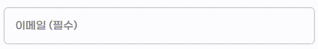     |
|  3  |   체크박스    |    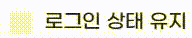     |
|  4  |   사이드 바   |          |
|  5  |  이미지 버튼  |  |
|  6  | 이미지 입력창 |    |
|  7  |     모달      |       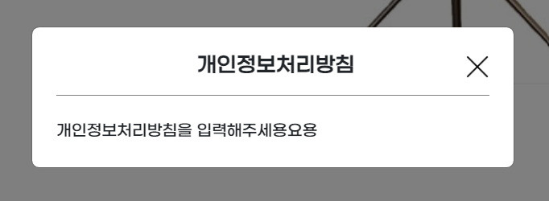        |
|  8  |  라디오 버튼  |    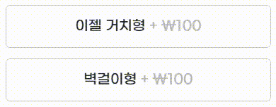    |

### 페이지

|  #  |       이름        |                                                                    이미지                                                                     |
| :-: | :---------------: | :-------------------------------------------------------------------------------------------------------------------------------------------: |
|  1  |      로그인       |                                                   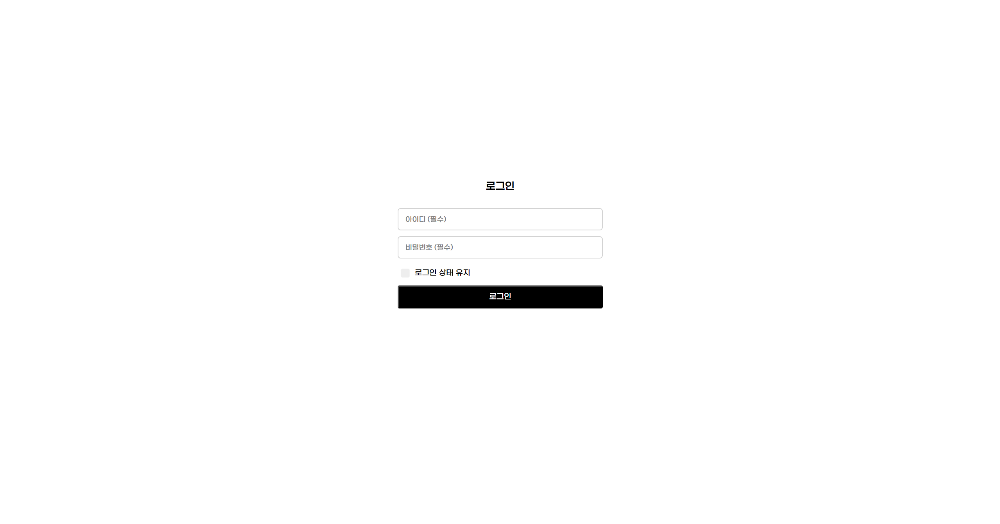                                                   |
|  2  |     고객 관리     |                                                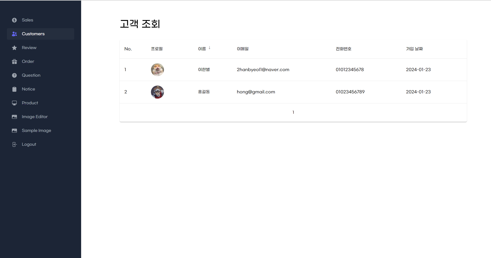                                                |
|  3  | 주문 취소 관리 탭 |                                                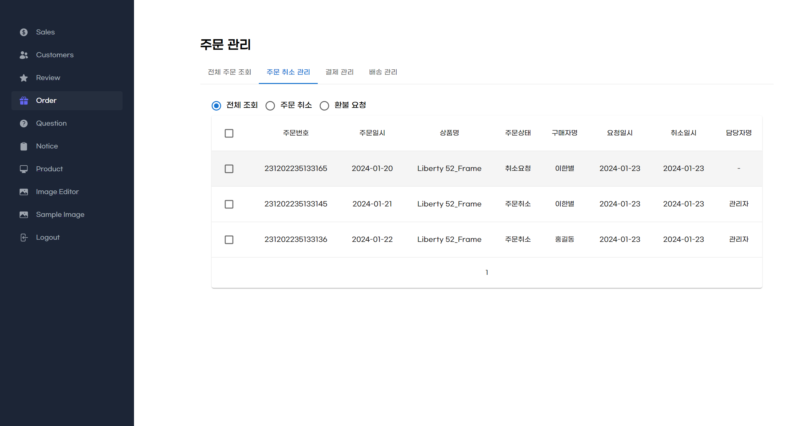                                                 |
|  4  |  주문 취소 모달   |                                               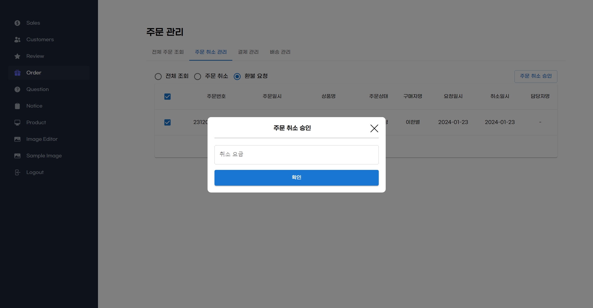                                                |
|  4  |     주문 상세     | 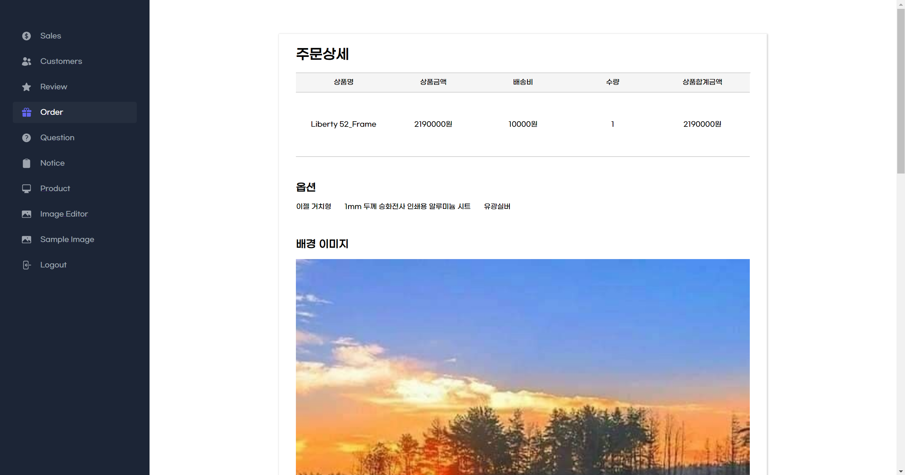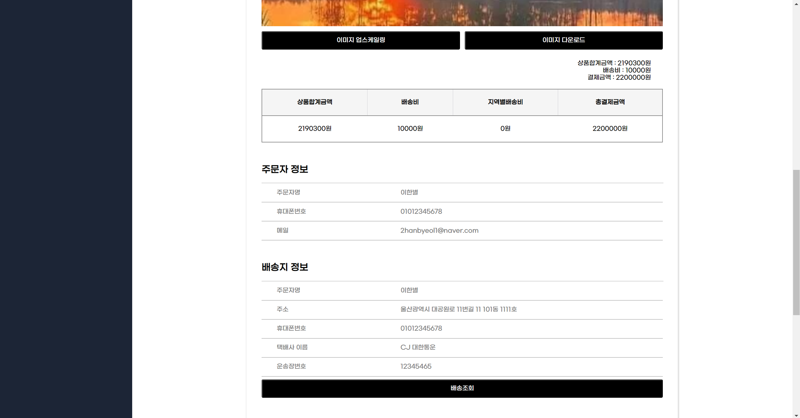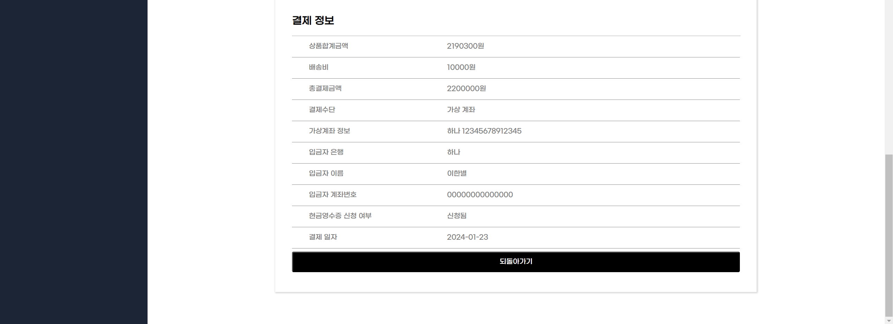 |
|  5  |     상품 관리     |                            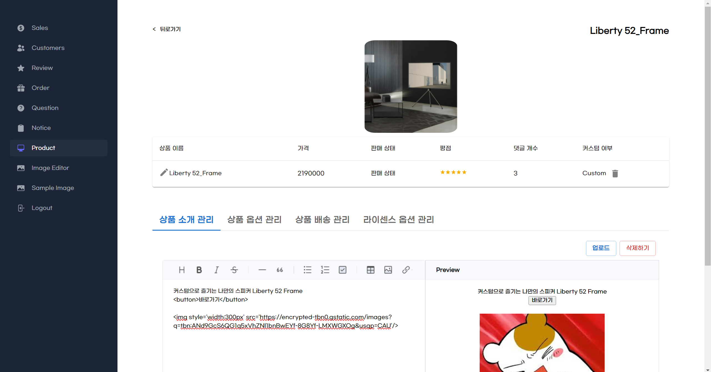                             |
